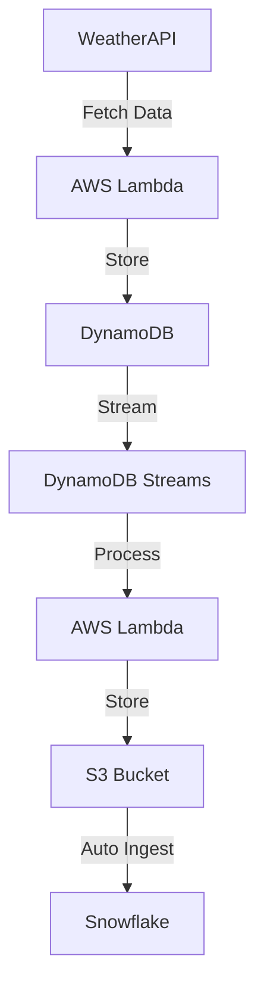

# 🌦️ Real-time Weather Data Pipeline: AWS to Snowflake

A robust real-time data pipeline that processes weather data from multiple Indian cities, demonstrating modern data engineering practices using AWS services and Snowflake.

## 🚀 Project Overview

This project implements an end-to-end data pipeline that:
- Fetches real-time weather data from WeatherAPI for multiple Indian cities
- Processes and stores data in DynamoDB
- Streams data to S3 using AWS Lambda
- Automatically loads data into Snowflake using Snowpipe

## 📋 Features

- **Real-time Data Processing**: Sub-minute latency for weather data updates
- **Scalable Architecture**: Serverless design using AWS Lambda
- **Automated Data Pipeline**: End-to-end automation from data ingestion to warehousing
- **Multi-city Support**: Processes weather data for 10 major Indian cities
- **Error Handling**: Robust error handling and data quality checks

## 🏗️ Architecture



## 🛠️ Technical Stack

- **AWS Services**
  - AWS Lambda
  - DynamoDB
  - S3
  - IAM
- **Data Warehouse**
  - Snowflake
- **Programming**
  - Python
  - Pandas
- **API Integration**
  - WeatherAPI

## 📁 Project Structure

```
.
├── fetch_weather_data.py    # Lambda function for fetching weather data
├── DDBStreamTOWarehouse.py  # Lambda function for DynamoDB to S3 processing
└── snowflake.sql           # Snowflake setup and configuration
```

## 📊 Data Flow

1. Weather data is fetched from WeatherAPI
2. Data is stored in DynamoDB
3. DynamoDB streams trigger Lambda function
4. Lambda processes data and stores in S3
5. Snowpipe automatically loads data into Snowflake

## 🤝 Contributing

Contributions are welcome! Please feel free to submit a Pull Request.

## 📝 License

This project is licensed under the MIT License - see the LICENSE file for details.

## 🙏 Acknowledgments

- WeatherAPI for providing weather data
- AWS for cloud infrastructure
- Snowflake for data warehousing capabilities
